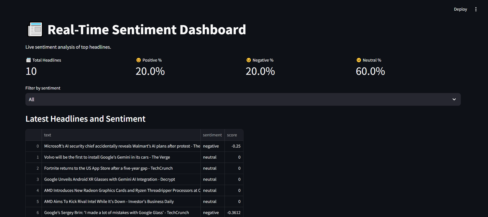

# 📊 Real-Time Sentiment Analysis Dashboard

This project is a **real-time sentiment analysis dashboard** that collects news headlines, analyzes their sentiment, and visualizes the results in an interactive Streamlit dashboard.

---

## 🚀 Features

- 🔄 Real-time sentiment analysis
- ⚡ Flask API for sentiment predictions
- 📈 Streamlit dashboard with live updates
- 📊 Sentiment distribution bar chart
- ✅ Easy setup with requirements.txt

---

---

👨‍💻 Author :
Anubhav Choudhary

[LinkedIn](https://www.linkedin.com/in/anubhav-choudhary-35b8ab254/) | [GitHub](https://github.com/ANUBHAV0112)

---
